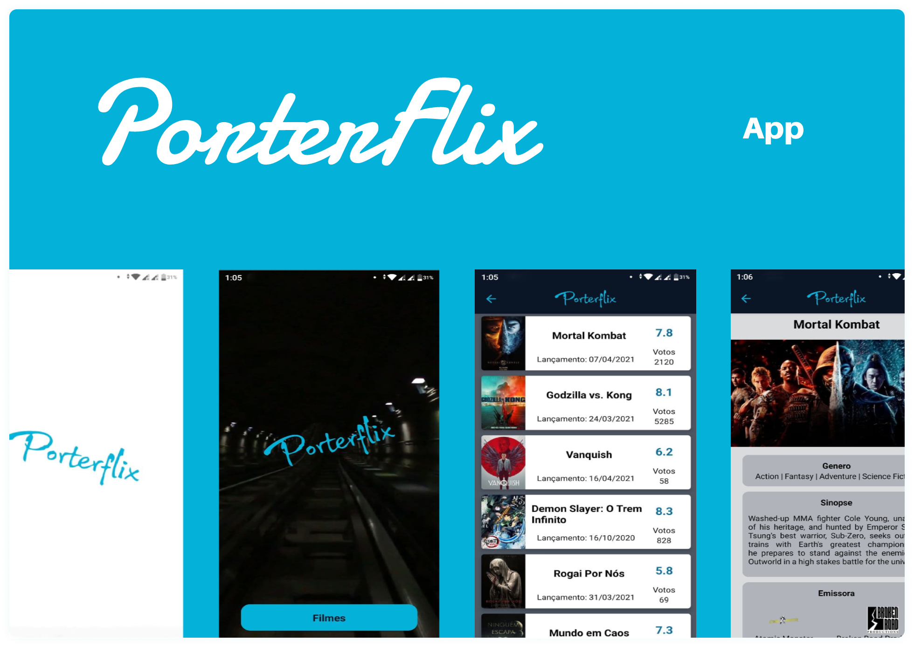

<h1 align="center">
  
</h1>

  

 

  

## ✨ Tecnologias

Esse projeto foi desenvolvido com as seguintes tecnologias:

- [React Native](https://reactnative.dev/)
- [Typescript](https://www.typescriptlang.org/)
- [Expo](https://expo.io/)

## 💻 Projeto

Aplicativo para visualizar lista de filmes lancamento de filmes e suas principois informações.

## 🚀 Como executar

- Clone o repositório
- Instale as dependências com `yarn`
- Altere o nome do arquivo `config.exemple.ts` para `config.ts` 
- Abra o arquivo `config.ts` adicione o `TOKEN` da api `themoviedb.org`
- Inicie seu app com `expo start`

## 📄 Licença

Esse projeto está sob a licença MIT. Veja o arquivo [LICENSE](LICENSE.md) para mais detalhes.

